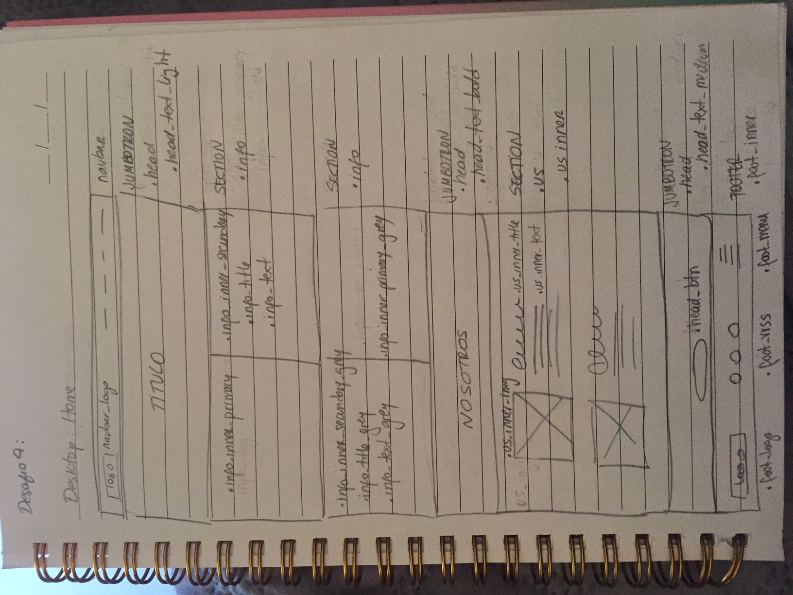
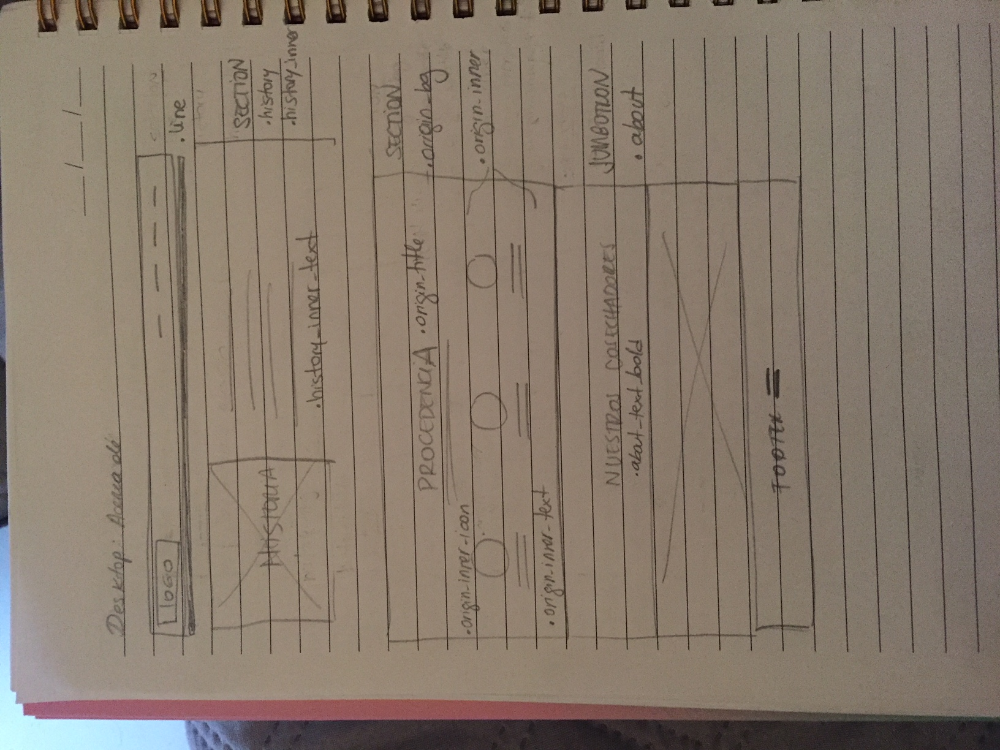
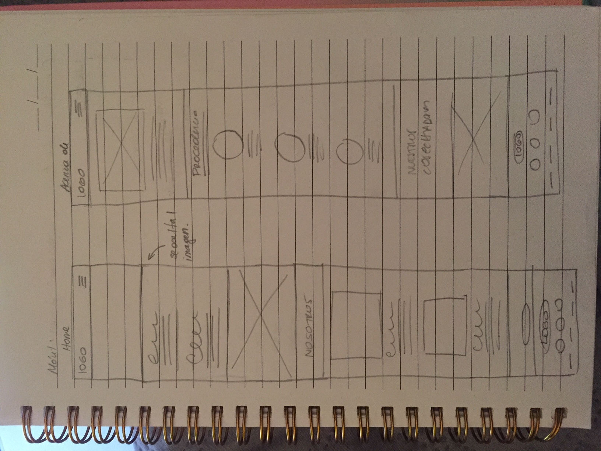
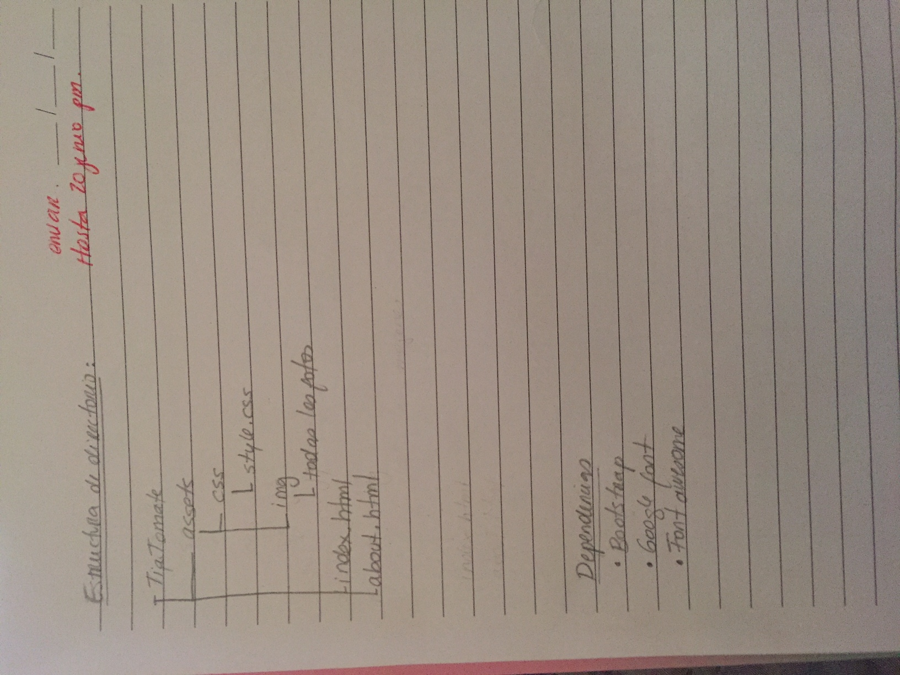

## Listado con los requerimientos visuales y técnicos de la web

1. Debia seguir la guía de estilos que el diseñador previamente habia determinado.
2. Diseño moderno.
3. Ser responsiva.
4. Mostrar la pasión que sienten por sus tomates.
5. Mostrar el logo de la empresa

## Fotos con skecth de versiones Escritorio y movil.

## Descripción de las secciones, layout, estructura HTML y clases CSS que decidiste usar.

Estan detalladas en el skecth.

## Agregar la estructura de directorio que hiciste, junto con las dependencias y otros archivos necesarios usados en el proyecto.

### Estructura de directorio

Sale boceteado en las imagenes anteriores. En definitiva es algo asi:

TiaTomate
 assets
  css
    style.css
  img
    todas las fotos

 imgreadme
  todas las fotos que se usaron en el readme

index.html
about.html

### Dependencias
Bootstrap
Google Font
Fontawesome
